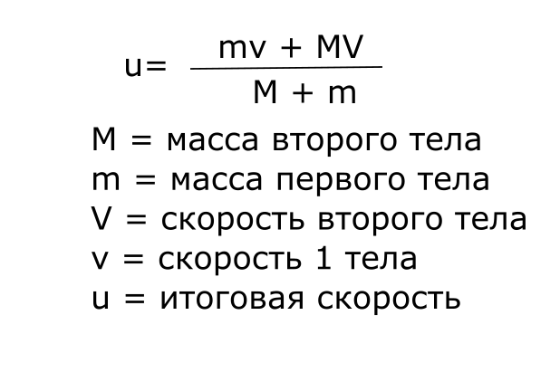
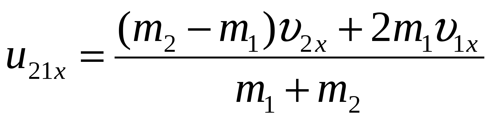

# Моделирование закона сохранения импульса в Unity

## Физика
все что как-то было связано с физикой находится в файле [ForceMover](https://github.com/AlexeyGorbunov72/modelingLabPhys/blob/master/Assets/scripts/ForceMover.cs);
этот класс отвечает за поведение объектов. Фунции в нем рассчитывают и задают значения скороcти объекту (в коде есть комментарии);
Формулы которыми я пользовался:
- 
​Для неупругого 
- 
​Для упрогого

